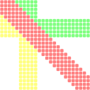
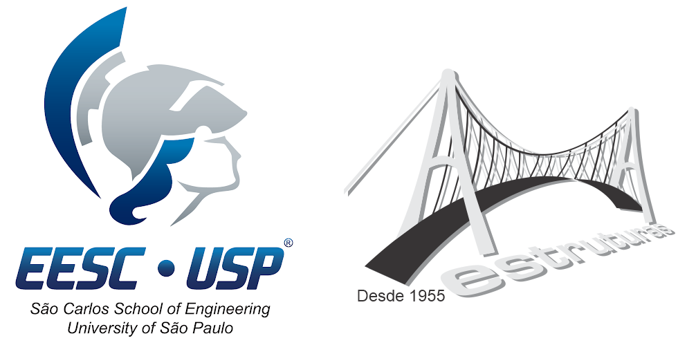

# M2S2 [](https://doi.org/10.5281/zenodo.11152222)
[](https://github.com/GEMeCo/M2S2/blob/main/LICENSE) [](https://github.com/GEMeCo/M2S2/issues) [](https://github.com/GEMeCo/M2S2/stargazers)

M2S2 is a simple C++ header-only library for linear algebra applied to mechanics of solids and structures. It was developed in the Structural Engineering Department, at Sao Carlos School of Engineering, University of Sao Paulo..

<h1 align="center">
  
</h1>

## Copyright Information:
:ballot_box_with_check: This program is free software: you can redistribute it and/or modify it under the terms of the [Apache License 2.0](https://www.apache.org/licenses/LICENSE-2.0).

:ballot_box_with_check: Redistributions of source code must retain the above copyright notice, this list of conditions and the disclaimer.

:ballot_box_with_check: Redistributions in binary form must reproduce the above copyright notice, this list of conditions and the disclaimer in the documentation and/or other materials provided with the distribution.

:ballot_box_with_check: This program is distributed in the hope that it will be useful, but WITHOUT ANY WARRANTY; without even the implied warranty of MERCHANTABILITY or FITNESS FOR A PARTICULAR PURPOSE.
It is provided "AS IS". In no event shall the authors be liable for any claim, damages or other liability, whether in an action of contract, tort or otherwire, arising from, out of or in connection with the software or the use of other dealing in the software.

:ballot_box_with_check: Neither the name of the copyright holder nor the names of any other contributors may be used to endorse or promote products derived from this software without specific prior written permission.

:triangular_ruler: None of the developers are **Software Engineers** of any sort. We are **Civil Engineers**, seeking to solve engineering problems. We know that this software has bugs and stuff to improve. We just don't have time to solve them all.

Documentation of this work, generated by doxygen, may also be used, distributed and modified, but under [Creative Commons Attribution-NonCommerical 4.0 International license](https://creativecommons.org/licenses/by-nc/4.0/).

<h1 align="center">
  
</h1>

## :warning: Under development - Use at your own risk. Improper use will crash your application. :warning:

Table of Contents
=================
<!--ts-->
   * [About](#about)
   * [Citation](#citation)
   * [Features](#features)
   * [Resources](#resources)
   * [Building and Running](#how-to-run)
   * [Using](#how-to-use)
   * [Documentation](#documentation)
   * [Project Managers](#project)
   * [How to contribute](#how-to-contribute)
   * [Acknowledgement](#acknowledgement)
<!--te-->

About
-----
M2S2 is a simple C++ header only library for linear algebra applied to mechanics of solids and structures. It was developed primarly to help FEM coding.

Citation
--------
  Whether it was used in whole or parts, citation is a must!

 This library is in Zenodo - thus, we got a DOI: [doi.org/10.5281/zenodo.11152221](https://doi.org/10.5281/zenodo.11152221)
 
 (:construction: We'll get there, eventually :construction:).

Features
--------
- v0.1.0: Dyadics and Matrices
    - :boom: M2S2::Dyadic2S - Symmetric 2nd rank tensors of 2 or 3 dimensional vector space;
    - :boom: M2S2::Dyadic2N - Asymmetric 2nd rank tensors of 2 or 3 dimensional vector space;
    - :boom: M2S2::Dyadic4S - Symmetric 4th rank tensors of 2 or 3 dimensional vector space;
    - :boom: M2S2::Dyadic4C - 4th order tensor for orthotropic constitutive matrices, in either 2 or 3 dimensional vector space;
    - :boom: M2S2::MatrixS - Symmetric square matrix of any order.
    - :boom: M2S2::MatrixX - 2nd rank matrices of any size, even not square.

- v0.2.0: Sparse Matrices
    - :boom: M2S2::sparseMatrix - Symmetric and Asymmetric square sparse matrices;
    - :boom: Save the sparseMatrix as CSR or CSC (Compressed Sparse Row or Compressed Sparse Column)
    - :boom: All features of M2S2 dyadics and matrices (but sparse) may be verified by unitTest() function.

- v.1.0: M2S2 goes gold
    - :boom: Finally, it is fully open for your use. Good luck.

Resources
---------
M2S2 doesn't have any dependencies other than the C++ standard library.

Building and Running
--------------------
1. Clone the source code
`git clone --recursive https://github.com/GEMeCo/M2S2.git`

2. Just include the main header file (don't forget to setup including directories). That's all there is to it. Good luck :innocent:.

```cpp
#include "m2s2.h"
```

Using
-----

### Creating
M2S2 brings up several dyadics and matrices for your usage as classes. Each one has some constructor at your disposal. Generate the documentation using Doxygen for details. Some examples are given next:

```cpp
M2S2::Dyadic2S matrix(3);                 // 3x3 symmetric matrix
M2S2::Dyadic2S symM2({ 0, 1, 2 });        // 2x2 symmetric matrix: | 0.0   1.0 |
                                          //                       | 1.0   2.0 |
M2S2::Dyadic2S symM3(symM1);              // Copy constructor
M2S2::Dyadic2S symM4 = symM2;             // Assignment constructor

M2S2::Dyadic2N asyM1(3, 2.0);             // 3x3 assymetric matrix, elements initiated with 2.0

M2S2::Dyadic4S symM5;                     // A uninitialized symmetric 4th order dyadic. It can be used for constitutive relations.

M2S2::Dyadic4C symM6(2);                  // Constitutive matrix of 4th rank (order) in 2D space for orthotropic materials. In Voigt notation:
                                          // | c1  c2  0.  0. |
                                          // | c2  c3  0.  0. |
                                          // | 0.  0.  c4  0. |
                                          // | 0.  0.  0.  c5 |
                                          // c1 to c5 are the matrix elements.

M2S2::MatrixS symM7 = M2S2::MatrixS::identity(4);  // 4x4 symmetric square matrix initiated as identity

M2S2::MatrixX asyM2(2, 3);                // 2x3 matrix - 2 rows by 3 columns

M2S2::sparseMatrix spM1(40, true);        // 40x40 symmetric sparse matrix (not initiated)
```

### Setting values
Use the operator () or the method `at` to set or get a value:

```cpp
double val;
matrix(0,0) = 10.;                        // Sets 10. on 1st row and 1st col
val = matrix.at(1,2)                      // Gets the value from 2nd row and 3rd col
```
:traffic_light: Most boundaries are checked. Also notice that rows and columns are indexed from 0. :traffic_light:

### Using
M2S2 provides several matrices operations, using operators or functions. See documentation for details. A few examples are provided.
:traffic_light: Most operations have their boundaries checked. Most, not all! :traffic_light:

#### Basic operations
M2S2 focuses on second order tensors of two and three-dimensional Euclidean spaces. Some useful functions may be easily accessed.

```cpp
M2S2::Dyadic2S mat(3);
std::vector<double> invar, eigen;
double value;

value = mat.determinant();               // determinant is available for Dyadic2S and Dyadic2N
invar = mat.invariants();                // matrix invariants are returned as std::vector
eigen = mat.eigenvalues();               // matrix eigenvalues are returned as std::vector
```

#### Dimensions
Simple functions return the matrix dimensions:

```cpp
int rows = mat.rows();                  // Available in Dyadics and Matrices classes, but not in Sparse.
int cols = mat.cols();
int size = mat.size();
```

Size may have different meanings, yet always related to the number of itens. The number of rows and columns for 4th rank dyadics are related to the number of Voigt.

#### Dyadic-Vector multiplication
Dot product is provided for 2nd rank dyadics. Inner product is also provided for 4th and 2nd rank dyadics.

```cpp
M2S2::Dyadic2S matS(3);
M2S2::Dyadic2N matN(3);
M2S2::Dyadic4C matC(3);
std::vector<double> vec(3);

M2S2::Dyadic2N resN(3);
std::vector<double> resV;

resV = matS * vec;                        // Dot / Inner product of symmetric dyadic and vector
resN = matC * matN;                       // Dot / Inner product of 4th rank symmetric dyadic and 2nd rank asymetric dyadic
```

#### Dyadic-Dyadic operations
Dyadics of same type and rank can be summed, substracted and multiplied. Contraction is also available as a method.

```cpp
M2S2::Dyadic2S matS1(3), matS2(3), resS(3);
M2S2::Dyadic2N matN1(3), matN2(3), resN(3);
double res;

resS = matS1 - matS2;                   // Simple substraction
matN1 += matN2;                         // Cummulative addition
resN = matS2 * matN2;                   // Multiplication of Symmetric and Assymetric matrices

res = matS1.contraction(matS2);         // Contraction or double dot product
```

#### Dyadic-scalar operations
Dyadics can be summed, substracted, multiplied and even divided by scalars using operators.

```cpp
M2S2::Dyadic2S matS1(3), resS(3);
M2S2::Dyadic2N matN1(3);

resS = matS1 + 2.;                      // Adds 2. to every element
matN1 /= 3.;                            // Cummulative division of every element by 3.
```

#### Sparse matrix operations
See attached `cpp` file to see an example of how to create and push values to a sparse matrix, and then saving it as a CSR matrix.
See also unitTest.h, as it provides several examples of how to use M2S2 matrices.

Documentation
-------------
Software documentation is made directly from annotated sources by doxygen. Use doxywizard to create the documentation.

Project Managers
----------------
[Dorival Piedade Neto](http://lattes.cnpq.br/6930392733648456)

[Rodrigo Ribeiro Paccola](https://orcid.org/0000-0002-9228-4180)

[Rogério Carrazedo](https://orcid.org/0000-0003-2750-034X)


How to contribute
-----------------
```bash
Sorry, but we are not accepting external contributions, at least yet.
Nevertheless, you may use (and modify) it as seen fit.
```

Acknowledgement
---------------
<h1 align="center">
  
</h1>

